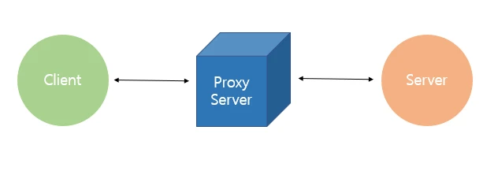
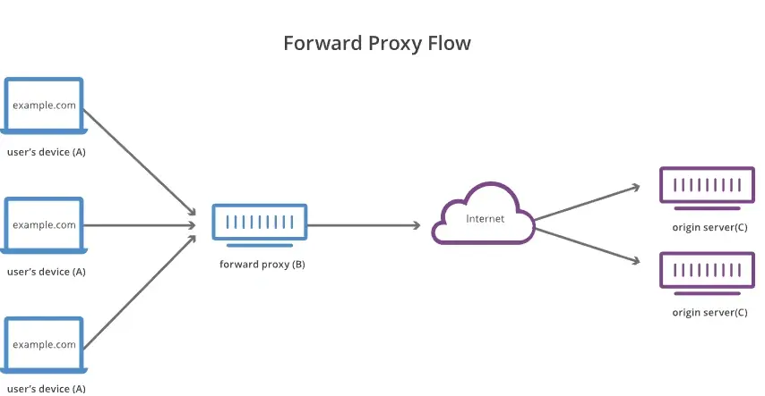
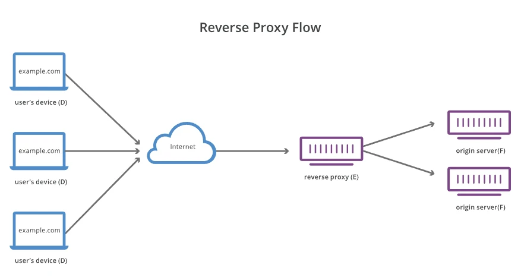

# 프록시

## 1. 개요
> ### 프록시(Proxy)
> </img>
> - 프록시(Proxy)란 '대리'라는 의미
> - 두 호스트가 통신할 때 서로 직접 통신하지 않고 중간에서 대리로 통신을 하도록 도와주는 것 
> - 프록시 서버: 클라이언트와 서버 사이의 중계서버로서의 역할 
> - 프록시는 대부분 웹 프록시를 뜻함 

## 2. 프록시 서버의 특징
> - 프록시 서버가 클라이언트와 서버 중간에 위치하면서, 클라이언트는 프록시서버를 서버로 인식하고 서버는 프록시 서버를 클라이언트로 인식하게 됨 
> - 다른 서버로의 자원 요청을 중계하며 분산 시스템 구조를 단순화하여 서비스의 복잡도를 줄일 수 있음 
> - 프록시 서버에는 클라이언트로부터 원격에 요청된 자원들이 캐시되어 임시로 저장되어 있어, 자원 재요청 시 원격 서버에 접속할 필요 없이 프록시 서버 내의 정보를 제공받을 수 있으므로 데이터 전송 시간과 외부 트래픽이 줄어들고 서버 측의 네트워크 병목 현상을 방지할 수 있음 
> - 프록시 서버 측에서 위험이 예상되는 웹 콘텐츠 및 악성코드를 필터링 함으로써 클라이언트 측의 보안을 향상시킬 수 있음 
> - 회사 및 중요 기관에서는 보안 유지를 위해 내부 통신과 외부 데이터 접근(특정 사이트 접근 차단)을 통제하고 인터넷 이용률 통계를 수집하기 위해 프록시 서버를 사용하기도 함 
> - 역기능으로는 사용자의 입장에서 자신의 웹 서핑 기록을 익명하기 위해 익명 웹 프록시를 사용하기도 함 

## 3. 프록시 서버 종류
> - 서버의 위치에 따라 분류하면 크게 두 가지로 나눌 수 있다.  
> ### Forward 프록시
> </img>
> - 일반적으로 프록시, 프로시 서버 혹은 웹 프록시라고 불림 
> - 클라이언트의 대신 프록시 서버가 목적 서버에 통신해주는 구성을 "포워드 프록시"라고 한다. 
> - 클라이언트들(A)이 서버(C)에 요청(Request)을 보내면 포워드 프록시(B)가 해당 요청을 서버 대신 받아서 서버에게 전달(Forward) 해준다. 마찬가지로 서버의 응답(Response)을 포워드 프록시가 대신 받아 클라이언트에게 전달해준다. 
> - 참고로 윈도우10의 경우 [Winodws 메뉴] > [설정] > [네트워크와 인터넷] > [프록시]에서 설정할 수 있다. 
> - 사용 목적 
> > 1. 캐시 저장(액세스 고속화) 
> > 2. URL 필터링 

> ### Reverse 프록시
> </img>
> - 리버스 프록시는 웹 서버들 앞에 위치하고 리버스 프록시도 포워드 프록시와 마찬가지로 클라이언트의 요청을 받아 서버에게 전달하고, 서버의 응답을 받아 클라이언트에게 전달한다.  
> - 사용 목적 
> > 1. 부담 분산 : 로드 밸런스와 병용하면 더욱 효과적이다. 
> > 2. 캐시의 저장 
> > 3. 세큐리티 대책, 바이러스 대책 

> ### 오픈 프록시
> - 모든 인터넷 사용자가 액세스할 수 있는 프록시 서버로 익명 공개 프록시는 사용자가 웹 브라우징을 하거나 다른 인터넷 서비스를 사용하는 동안 자신의 IP 주소를 숨길 수 있도록 해준다. 

 
 
***
#### 참고사이트 
[참고 1](https://code-lab1.tistory.com/214)  
[참고 2](https://engineer-mole.tistory.com/288)  
[참고 3](https://brownbears.tistory.com/191)  
[참고 4](https://dany-it.tistory.com/107) 
 
#### 기타 참고사이트 
[WEB/WAS](https://gmlwjd9405.github.io/2018/10/27/webserver-vs-was.html) 
[면접준비](https://gyoogle.dev/blog/guide/%EB%A9%B4%EC%A0%91%20%EC%A4%80%EB%B9%84.html) 