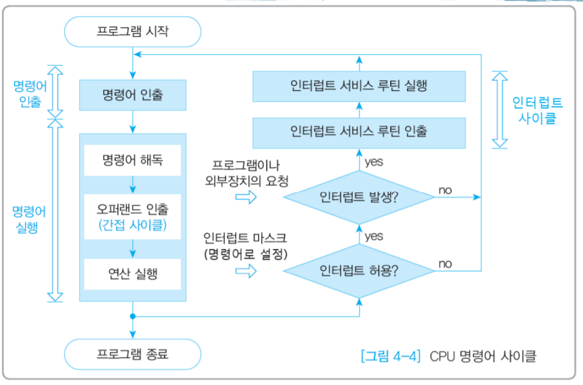

# 4-3 명령어 사이클과 인터럽트

### 명령어 사이클

- CPU가 명령어를 처리하는 과정에서 일어나는 연산과정
- 순서
    - 1 인출사이클
        - 메모리에 있는 명령어를 CPU로 가져옴
        1. PC안에 있는 주소를 MAR → IR → 명령어 실행위해 PC 값 +1
    - ( 2 간접사이클 )
        - 간접 주소 지정 방식을 예로 들면 오퍼랜드 필드에 유효 주소의 주소를 명시하므로 명령어를 가져오더라도 메모리에 있는 유효 주소를 한 번 더 참조해야 하므로 실행 사이클에 바로 돌입할 수 없음
    - 3 실행사이클
        - CPU로 명령어를 인출했다면 명령어를 실행
        - 명령어를 실행하는 단계로 제어 장치가 명령어 레지스터에 담긴 값을 해석하고 제어 신호를 발생
    - ( 4 인터럽트 사이클 )
        - 실행 사이클이 끝나고 실행, 인터럽트 신호 유무 판단
- 스택구조
    - 인터럽트 사이클을 위해 우선처리 되는 경우가 있음
    - 후입 선출의 stack 사용
    

### 2. 인터럽트

- **인터럽트 (interrupt)** : CPU의 작업을 방해하는 신호
- 순서 : 요청 > 중단 > 보관 > 처리 > 재개
- 종류
    
    
    
- 단어들
    - ISR (inerrupt service ) : 인터럽트를 처리하기 위한 프로그램, **인터럽트 핸들러**라고도 함
    - 인터럽트 플래그 : 레지스터에 활성화 되어있어야함
    - 인터럽트 백터 : 인터럽트 서비스 루틴을 식별하기 위한 정보
- 예외의 종류
    - 동기
        - CPU가 명령어들을 수행하다 예상치 못한 상황에 마주쳤을 때 발생
        - **폴트(falut) :** 예외를 처리한 직후 예외가 발생한 명령어부터 실행을 재개
        - **트랩(trap) :** 예외 처리 직후 예외가 발생한 명령어의 다음 명령어부터 실행을 재개 (디버깅 시 사용)
        - **중단(abort) :** CPU가 실행 중인 프로그램을 강제로 중단시킬 수 밖에 없는 심각한 오류를 발견했을 때 발생하는 예외
        - **소프트웨어 인터럽트(software interrupt) :** 시스템 호출이 발생했을 때 나타나는 예외
            - CPU 코어 외부에서 인터럽트를 거는 경우가 일반적이지만, CPU 내부에서 실행하면서 인터럽트에 걸리는 경우
            - Divide by Zero , Overflow/underflow
    - 비동기 (하드웨어)
        - 주로 입출력장치에 의해 발생하는 인터럽트
        - 알림 등 (왜> 효율적인 명령어 처리위해서)
        - 외부
            - CPU 코어 외부에서 어떤 일이 발생한 것을 전기적인 신호로 CPU에게 통지하는 경우
            - 기계고장, 입출력 오류, 전원이상 등
    
- 추가 (만약에 여러 인터럽트 발생시?)
    - **전원 이상(Power fail) > 기계 착오(Machine Check) > 외부 신호(External) > 입출력(I/O) > 명령어 잘못 > 프로그램 검사(Program Check) > SVC(SuperVisor Call)**
    - 하드 > 소프트, 외부 > 내부

https://whatisthenext.tistory.com/m/147

https://gamedevlog.tistory.com/m/71