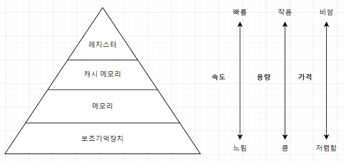
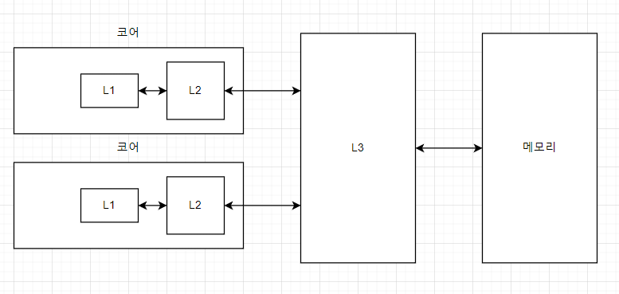

# 6-3 캐시메모리

<aside>
💡 캐시 메모리란?
CPU와 메모리 사이에 위치하여 CPU가 자주 사용하는 데이터나 명령어를 저장하는 작은 용량의 SRAM기반 메모리
→ 접근 속도의 차이를 줄여(=캐시 적중률을 올려) 성능 향상 목적

</aside>

- 저장장치의 구조
    
    
    

### 특징

- CPU와 가까운 순서대로 계층을 구성 ⇒ 속도가 빠르고 + 용량이 작다
    - **L1, L2 (**일반적으로 코어 내부 위치), L3 (코어 외부)
        
        
        
- 캐시 메모리는 CPU가 자주 사용할 법한 대상을 예측하여 저장함
- 캐시 히트(cache hit) : 저장 O → 활용 O
- 캐시 미스(cache miss) : 저장 O → 활용 X
- 참조 지역성 원리**(locality of reference, principle of locality)**
    - CPU가 메모리에 접근할 때의 주된 경향을 바탕으로 만들어진 원리
    - 캐시 메모리가 메모리로부터 가져올 데이터를 결정하는데에 쓰이는 원칙
    - **시간 지역성(temporal locality)**
        - CPU는 최근에 접근했던 메모리 공간에 다시 접근하려는 경향
        - 연속적인 요소 참조시 데이터가 남아있을 확률 높음
    - **공간 지역성(spatial locality)**
        - CPU는 접근한 메모리 공간 근처를 접근하려는 경향이 있음
        - 실행 프로그램 관련 데이터 뭉쳐있음 - 인접한 데이터도 함께 로드 됨
- 주의! 큰 용량의 데이터를 다루는 경우 이점이 크지 않을 수 있음
캐시 메모리와 저장된 메모리는 일관성을 유지해야 함
- 리눅스? 자주 사용하는 파일, 위치 정보등을 버퍼와 캐시 영역으로 자동할당하기 때문에 디스크 I/O 성능관리 좋음