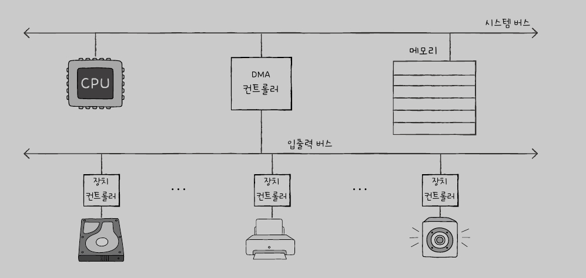

# 8-2 다양한 입출력

### 1. 프로그램 입출력

- 프로그램 입출력 =  **프로그램 속 명령어로 입출력 장치를 제어하는 방법**
- 입출력 작업이 완료될 때까지 프로그램이 대기하게 됨
- CPU가 장치 컨트롤러의 레지스터 값을 읽고 써서 이루어짐
- 예시
    1. CPU > 하드웨어 디스크에 쓸거야 
    제어레지스터: 쓰기
    2. 하드웨어 디스크 컨트롤러 > 하드웨어 디스크 상태 확인 
    상태레지스터 : 준비완료
    3. CPU > 하드웨어 디스크 쓰기
    데이터레지스터:저장할 데이터 
- 방식
    1. 메모리 맵 입출력
        - 메모리 접근 주소공간 + 입출력 접근 주소공간 = 레지스터에 매핑
        - 메모리 주소 공간 축소, 같은 명령어 사용
        - 0~1023 : 123→제어, 124→상태, 125→데이터 126→접근주소
    2. 고립형 입출력
        - 메모리 주소공간과 / 입출력 주소공간 분리
        - 메모리 주소 공간 축소 불가, 입출력 전용 명령어 사용
        - 0~1023 입출력, 0~1023 메모리공간

### 2. 인터럽트 기반 입출력

- 입출력 작업이 완료될 때까지 프로그램이 대기하지 않아도 되어 시스템 자원 효율성이 높음
- CPU가 입출력 작업을 처리하면서 다른 작업을 수행할 수 있음
- 입출력 작업이 완료되면 입출력 장치에서 인터럽트 신호를 보내어 CPU에 알리고, CPU는 인터럽트 핸들러를 호출하여 해당 인터럽트를 처리함
- 동시에 여러 요청이 오는 경우 우선순위가 높은 순서부터 처리
    - NMI (non-maskable interrupt) : 무시 불가능한 인터럽트
    - PIC : 우선순위를 판별하여 먼저 처리할 요청 알려줌, 부품
- **풀링? 입출력 장치와 처리 데이터가 있는지 주기적으로 확인 
↔ 인터럽트 : 요청이 오면 처리함, 사이클 관리에 좋음**

<aside>
💡 1, 2의 공통점 : 입출력 장치와 메모리 간의 데이터 이동은 CPU가 주도하고 이동하는 데이터도 반드시 CPU를 거친다는 점

</aside>

### 3. DMA 입출력(****Cycle Stealing)****

- **DMA(Direct Memory Access) : 입출력 장치와 메모리가 CPU 를 거치지 않고 입출력 작업을 수행하는 DMA 컨트롤러를통해 데이터를 전송하는 방식**
- CPU는 DMA 컨트롤러에게 입출력 작업을 위임하고, 입출력 작업을 처리하면서 다른 작업을 수행할 수 있음 ↔ 제어 불가능
- DMA 컨트롤러는 입출력 작업이 완료되면 CPU에게 인터럽트 신호를 보내어 해당 인터럽트를 처리함
- 입출력 작업을 처리하는 동안 CPU가 입출력 버스를 점유하지 않아도 되므로 시스템 자원 효율성이 높음
- 예시: 하드 디스크에서 데이터를 읽어오는 동안 DMA 컨트롤러를 사용하여 데이터를 메모리에 전송하는 방식

### 입출력버스

- 메모리버스
    - 중앙 처리 장치(CPU)와 주 메모리 간에 데이터와 명령어를 전송하기 위한 데이터 경로
- 입출력버스
    - 입출력 버스는 입출력(I/O) 장치와 CPU 간에 데이터를 전송하기 위한 데이터 경로
    
    [https://devraphy.tistory.com/m/362](https://devraphy.tistory.com/m/362)