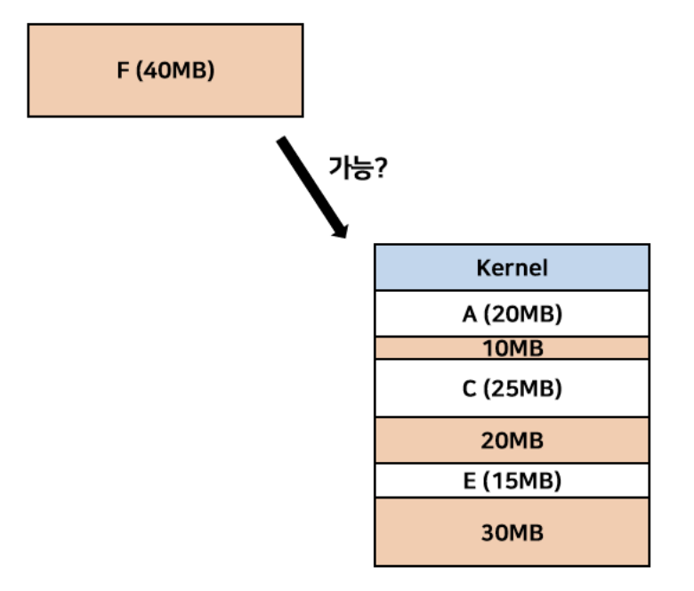
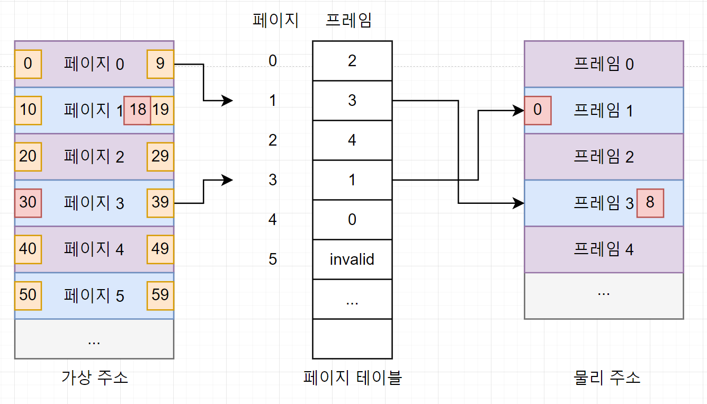

# 14-2 페이징기법

- 공간있는데 왜 못넣을까,,

### 페이징 기법

- 고정분할 방식(=페이지)을 이용한 가상 메모리 관리기법
- 물리 메모리보다 큰 프로세스 실행 가능
- 가상메모리는 선형구조 (스택, 힙, 등등,,)
- 외부 단편화 문제 해결

### 페이징 구현

- 페이지 : 프로세스의 논리 주소 공간 = PROCESS = virtual address
    - 페이지 번호와 오프셋(줄 번호)
    - VA = <P,D> = 논리주소 = <페이지번호, 변위>
    - 프로세스 연속적으로 배치
- 프레임 : 메모리 물리 주소 공간 = RAM = physical address
    - 오프셋은 같음, 어드레스 바인딩
    - PA = <F, D> = 물리주소 = <프레임번호, 변위>
    - 프로세스 불연속적으로 배치될 수 있음
- 페이징 시스템의 스왑 아웃
    - 스왑 인(페이지 인, 사용중) → 메모리
    - 스왑 아웃(페이지 아웃, 미사용) → 보조기억장치(스왑영역)

- 페이지 테이블 : 페이지 번호 ↔ 프레임 번호 짝 지어주기
    - PTBR(Page Table Base Register) : 프로세스의 페이지 테이블이 적재된 주소
    - PRLR : 페이지테이블 최대 크기
    - 페이지 크기에 따라 내부 단편화 발생할 수 있음 → 적절히 조절필요
    - (10kb씩 자르는데 12kb → 10kb, 2kb 남음)
- 페이지 테이블 엔트리 : 각각의 행
    - 유효 비트 : 해당 페이지 접근 가능여부(1(메모리적재, 접근가능)/0(메모리적재x,접근불가) → **페이지 폴트(Page Fault)**
    - 보호 비트 : 보호기능을 위해 읽기/쓰기/실행
        - rwx (r : 읽기, w : 쓰기, x : 실행) 4bit
    - 참조 비트 : CPU가 페이지 접근여부 판단(1(적재이후사용)/0(미사용))
    - 수정 비트: 페이지에 데이터를 쓴적이 있는지 수정 여부 (= 더티비트), (1(변경o) / 0 (변경X))
    

→ CPU가 프로세스 실행시 메모리의 페이지 테이블 + 실제 프레임 두번 접속

- TLB : Translation Lookaside Buffer
- 페이지 테이블의 캐시를 메모리에 저장
- 캐시에 있다! : TLB히트, 캐시에 없다 : TLB 미스

### 좀 더 알아보기

- 쓰기시 복사
    1. 자식 프로세스가 시작할 때, 부모 프로세스의 페이지들을 당분간 함께 공유
    2. 둘 중 한 프로세스가 공유 중인 페이지에 쓸 때, 페이지의 복사본을 생성
    3. 수정되는 페이지만 복사본을 만들어 효율적으로 프로세스를 관리
- 계층적 페이징
    - 모든 페이지 테이블 엔트리를 항상 메모리에 유지
    - 다단계 페이지 테이블 VA = <P1, P2, D>
    - 바깥 페이지 번호 , 안쪽 페이지 번호, 변위
    
    
    

[[ 운영체제 ] 메모리 관리 1 - 페이징(Paging)](https://charles098.tistory.com/106)