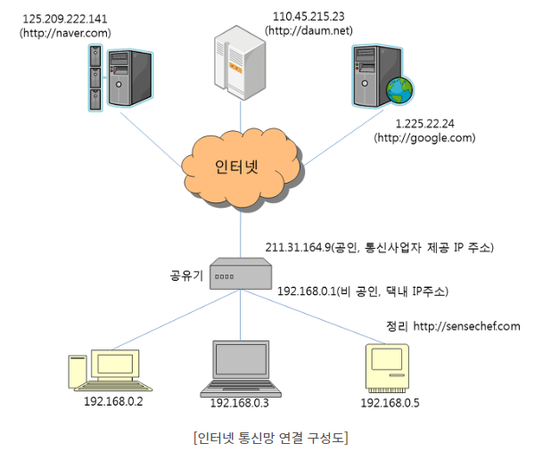
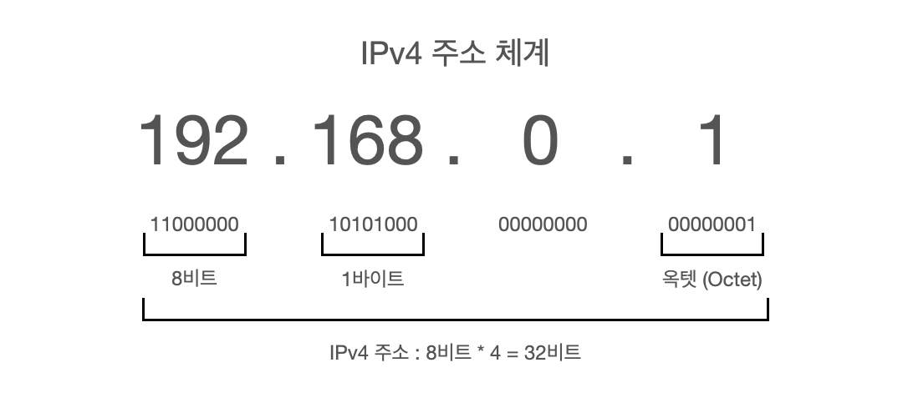

# IP 주소

### 1. IP(**I**nternet **P**rotocol) ?

- 송신 호스트와 수신 호스트가 네트워크 상에서 정보를 주고받는 데 사용하는 정보 위주의 규약(Protocol)
- OSI 네트워크 계층에서 호스트의 주소지정, 패킷 분할 및 조립 기능 담당

### 2. IP주소(Internet Protocol address) ?

- 컴퓨터 네트워크에서 장치들이 서로를 인식하고 통신을 하기 위해서 사용하는 특수한 번호

- 전 세계적으로 ICANN 이란 기관에서 국가별로 사용할 IP 대역 관리

- 한국에서는 한국인터넷진흥원(KISA)에서 국내 IP 주소들을 관리 

- IP주소 종류 : IPv4, IPv6 (일반적으로 IP주소는 IPv4)

- 방식에 따른 IP주소 : 고정IP / 유동IP / 공인IP / 사설IP 

  - 고정 IP 

    - 변하지 않고 **컴퓨터에 고정적으로 부여되는 IP**
    - **특징 : 보완성이 우수하여 업체나 기관에서 사용 / 단, 비싸다**

  - 유동 IP

    - 변화하는 IP로 인터넷 사용자들이 접속할 때마다 **임시로 발급해주는 IP**
    - **특징 : 보완성이 낮고 개인들이 사용 **

  - 공인 IP

    - KISA에서 관리하는 주소들을 ISP(Internet Service Provider)가 부여받음

      -> ISP : KT, LG, SKT와 같이 인터넷을 제공하는 통신업체

    - 공유기를 사용하여 인터넷을 접속할 경우 **공유기까지는 공인 IP 할당**하지만, **가정이나 회사의 각 네트워크 기기에는 사설 IP 할당**

    - **특징 : 공개되어 있어서 보안에 취약하고 대여비가 비쌈**

  - 사설 IP

    -  NAT(Network Address Translation) 기술을 사용해서<u> **공유기 하나로 여러 IP를 가**</u>

      <u>**상으로 만들어 사용함**</u>

    - 회사의 경우, 본부와 지사간의 회선을 직접 설치해서 네트워크 연결

    - **특징 : 특정 사람들만 쓰기 때문에 거리가 멀면 설치 및 유지보수 비용 증감(망 임대비 등)**

### 3. VPN(Virtual Private Network) ?

- 공중망을 이용해서 사설망을 대체하는 효과를 줌
- **특정인만 접속**할 수 있도록 네트워크를 구축
- 기기의 주소가 VPN 서버의 IP주소로 표시되므로, 개인 IP 주소 노출이 안됨(보안 우수)
- **특징 : 주소 및 라우터 체계의 비공개, 데이터 암호화, 사용자 인증 및 사용자 엑세스 권한 제한 등** 
- 재택근무, 출장, 국내에서 접속 안되는 해외 사이트 등에 접속하고자 할 때 사용됨

### 4. IP 주소 추가

 1. url 접근 시 timeout 등 오류 뜨는 경우 : 방화벽 업체에 문의

 2.  아파치 conf  파일에 ip 추가 : **httpd.conf 또는 httpd-vhosts.conf  또는 httpd-ssl.conf (SSL 사용중일 때) 해당 conf 파일에 모두 추가**

    **Allow from IP주소** 

 3.  ip 추가 후 아파치 재시작 (**graceful**) : 아파치 설치된 위치에서 재시작

 4. (필요 시) 호스팅 업체 확인  

 5.  아파치 **접근 로그 모니터링** : tail -100f /usr/local/apache2/logs/access_log.날짜.log

6. 아파치 접근 로그에 안 찍히면 error 로그 확인 
7. 해당 대역대의 **모든 PC** 열어줄 경우에는 **IP 뒤에 0/24 추가** : 123.123.11.0/24 (11번대 대역 모두 사용)

####인터넷 연결 구성도
</img>

 

####IPv4 주소체계
</img>