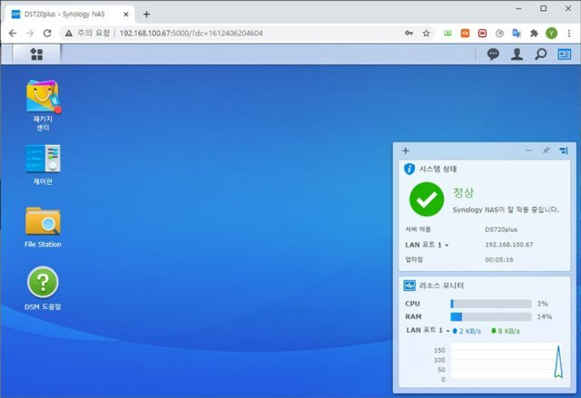

# NAS 서버

## 1. 개요
> ### **Network Attached Storage**
> - 네트워크 연결 저장 장치 (LAN으로 연결하는 외장 하드디스크)  
> <-> DAS(직접 결합 저장장치, Direct Attached Storage, 내장형 하드디스크/eSATA 규격 외장 하드디스크) 
> - NAS 디바이스는 데이터 스토리지 및 파일 공유 요청만 처리하는 특수 서버.

## 2. NAS 디바이스 구성 요소
> 1. 물리적 스토리지 드라이브 
> 2 ~ 5개의 하드 드라이브 + RAID (여러개의 디스크를 하나의 디스크처럼 사용하는 기술)
> 2. 중앙 처리 장치(CPU) 
> 컴퓨팅 인텔리전스와 파일 시스템 관리 기능을 제공하는 CPU가 있다. 
> 파일을 처리 및 제공하고, 여러 사용자를 관리하는 역할 등을 한다. 
> 3. 운영 체제 
> 복잡한 네트워크 연결 저장 장치 디바이스는 자체 운영 체제와 함께 제공되지만 
> 일부 더 단순한 디바이스에는 운영 체제가 없을 수 있다. 
> 4. 네트워킹 인터페이스 
> 네트워크 연결은 이더넷 케이블 또는 Wi-Fi를 사용할 수 있다. 
> 많은 NAS 디바이스에 충전하거나 다른 디바이스를 NAS 디바이스에 연결하기 위한 USB 포트도 있다. 

## 3. NAS의 작동 방법
> > NAS 시스템은 하드웨어와 소프트웨어를 프로토콜 또는 규칙과 결합하여 네트워크를 통한 파일 공유를 지원한다.
> 
> - 통신 프로토콜 
> 대부분의 네트워크에는 인터넷 프로토콜(IP)과 전송 제어 프로토콜(TCP)이 있다. 
> IP는 파일 데이터를 전송할 주소 부분이고 TCP는 데이터를 패킷으로 결합하여 네트워크를 통해 패킷을 전송하여 데이터를 전달한다. 
> 
> - 파일 형식 프로토콜
>   1. 네트워크 파일 시스템(NFS) - Linux 및 UNIX 시스템에서 사용. NFS는 모든 하드웨어, OS 또는 네트워크 아키텍처에서 작동한다. 
>   2. 서버 메시지 블록(SMB) - Microsoft Windows 시스템은 이 프로토콜을 사용한다. 
>   3. Apple 파일링 프로토콜(AFP) - macOS를 실행하는 Apple 디바이스를 위한 독점 프로토콜이다. 

## 4. 여러 유형의 NAS 디바이스
> 1. 컴퓨터 기반 NAS 
> 일부 NAS 디바이스는 프로세서와 운영 체제를 갖춘 목적별 컴퓨터입니다.  
> 기술적으로 NAS 장치에서 다른 소프트웨어를 실행하는 것이 가능할 수 있지만 컴퓨터 기반 NAS는 범용 서버로 설계되지 않았습니다.  
> 예를 들어 NAS 장치는 일반적으로 키보드나 디스플레이가 없으며 네트워크를 통해 제어되고 구성됩니다. 
>
> 2. 임베디드 시스템 NAS 
> NAS 디바이스에는 모든 기능을 갖춘 운영 체제가 필요하지 않으므로  
> 일부 NAS 공급 업체는 하드웨어에 직접 경량 운영 체제를 포함시킵니다. 
>
> 3. 통합 칩 기반 NAS 
> 가장 낮은 수준의 NAS 디바이스는 통합 마이크로칩 프로세서를 사용합니다.  
> 운영 체제 없이 칩에서 직접 파일 서버 기능을 관리합니다. 이러한 NAS 디바이스는 덜 일반적입니다. 

## 5. NAS의 한계
> 1. 확장하기 어려움 
> 네트워크 연결 저장 장치는 하드 디스크 드라이브(HDD)를 사용하여 데이터를 제공합니다.  
> 너무 많은 사용자가 동시에 파일 요청을 보내면 NAS 시스템에 과부하가 발생할 수 있습니다. 
> 
> 2. 서비스 보장 없음 
> NAS는 스토리지 서비스를 보장할 수 없습니다.  
> 사용자에게는 데이터 지연, 데이터 누락 및 데이터 손실과 같은 문제가 발생할 수 있습니다.  
> NAS는 미션 크리티컬 작업에 사용할 만큼 충분히 안정적이지 않습니다.

## 6. 대표 브랜드
> 1. 시놀로지 - 대만회사, DSM(운영체제)
> 2. 큐냅 - 대만회사
 
 
***
### * 시놀로지 이미지
</img>
</img>
</img>
</img>
</img>
</img>
 
 
***
### * RAID 이미지
</img>
</img>
 
</img>
</img>
</img>
 
 
***
#### 참고사이트 
[AWS NAS 설명 페이지](https://aws.amazon.com/ko/what-is/nas/)
 
[동아 NAS 리뷰 기사](https://www.donga.com/news/It/article/all/20210204/105290520/1)
 
[RAID 설명 페이지](https://www.stevenjlee.net/2020/03/01/%EC%9D%B4%ED%95%B4%ED%95%98%EA%B8%B0-raid-%EA%B5%AC%ED%98%84-%EB%B0%A9%EC%8B%9D%EA%B3%BC-%EC%A2%85%EB%A5%98%EC%97%90-%EB%8C%80%ED%95%98%EC%97%AC/)
