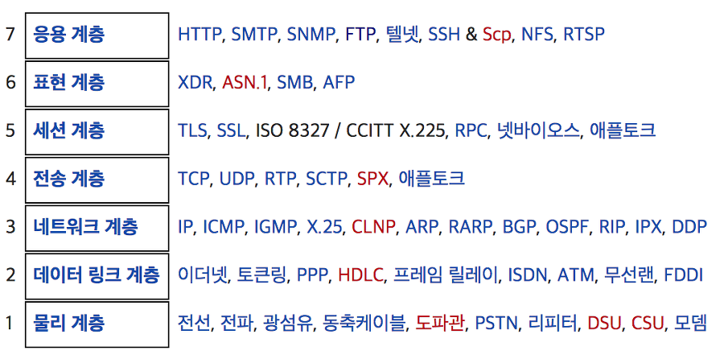
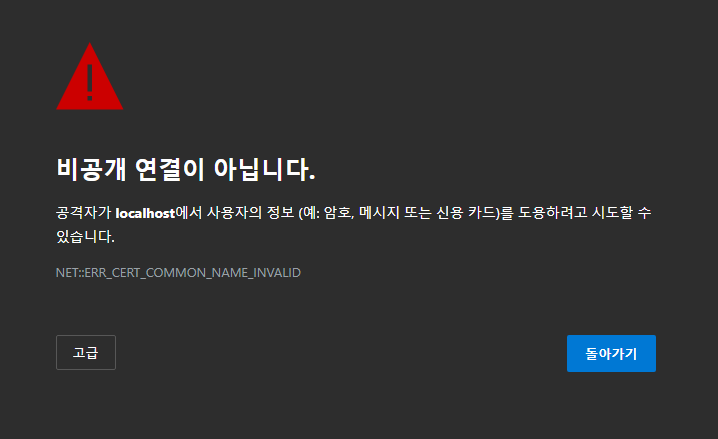

# TLS / SSL

## 1. 개요
> ### **Transport Layer Security / Secure Sockets Layer**
> - 암호화 기반 인터넷 보안 프로토콜 
> - 인터넷 통신의 개인정보 보호, 인증, 데이터 무결성을 보장하기 위해 Netscape가 1995년 처음으로 개발 
> - SSL은 현재 사용 중인 TLS 암호화의 전신이다. TLS가 SSL의 후속 버전이지만, 같은 의미의 단어이며 SSL이 일반적으로 더 많이 사용되는 용어이다. 
> - SSL/TLS를 사용하는 웹사이트의 URL에는 "HTTP" 대신 "HTTPS"가 있다.(HTTP 뒤에 붙는 S는 보안(Secure)을 의미) 

## 2. SSL => TLS
> - SSL은 TLS(Transport Layer Security)이라는 또 다른 프로토콜의 바로 이전 버전이다. 
> - 1999년 IETF(Internet Engineering Task Force)는 SSL에 대한 업데이트를 제안했고 이 업데이트를 개발할 때 IETF만 참여하고 Netscape는 더 이상 참여하지 않게 되면서, 이름이 TLS로 바뀌었다. 
> - SSL의 최종 버전(3.0)과 TLS 첫 버전의 차이는 크지 않으며, 이름이 바뀐 것은 소유권 변경을 나타내기 위한 것이다. 
> - 두 용어가 혼합되어 사용되는 경우가 많다. TLS를 아직 SSL이라 부르기도 하고, SSL의 인지도가 높아 ‘SSL/TLS 암호화’라 부르는 경우도 있다. 
> - SSL은 1996년 SSL 3.0 이후 업데이트되지 않았으며, 앞으로 사라지게 될 것으로 여겨지고 있다. 
> - TLS는 현재 온라인으로 실행되고 있는 최신 암호화 프로토콜인데, 아직 이를 "SSL 암호화"라고 부르는 사람도 있다. 이 때문에 보안 솔루션 구매 시 혼란이 일어날 수 있다. 실제로, 현재 "SSL"을 제공하는 업체는 사실 상 TLS 보호를 제공하는 것이며, 이는 거의 20년 동안 업계 표준으로 자리 잡고 있다. 

## 3. HTTS != SSL
> - SSL과 TLS는 '보안계층(세션계층)'이라는 독립적인 프로토콜 계층을 만들어, 응용계층과 전송계층 사이에 속하게 된다. 
> - HTTPS는 SSL 또는 TLS 위에 HTTP 프로토콜을 얹어 보안된 HTTP 통신을 하는 프로토콜이다. 즉, SSL과 TLS는 HTTP뿐만 아니라 FTP, SMTP와 같이 다른 프로토콜에도 적용할 수 있으며, HTTPS는 TLS와 HTTP가 조합된 프로토콜을 의미한다. 

## 4. SSL 작동 방식
> 1. 핸드셰이크 : SSL은 80번 포트를 사용하는 http와 달리 443번 포트를 기본으로 사용하는 TCP 기반의 프로토콜이기 때문에 SSL 핸드셰이크 전에 TCP 3-way 핸드셰이크를 수행한다. 그 후 SSL 핸드셰이크를 수행한다. 
> 2. 전송 : 핸드셰이크가 완료되면, SSL 세션이 생성되고 클라이언트와 서버는 원하는 데이터를 주고 받는다. 
> 3. 종료 : 데이터 전송의 끝을 서로에게 알리며 세션을 종료한다.  

## 5. 핸드셰이크 단계에서 무엇을 협상하는가?
> - **Client hello** : 클라이언트가 서버에게 연락하는 것. 브라우저 검색창에 도메인을 입력하는 것으로 보면 된다. 이때 클라이언트는 자신의 브라우저가 지원할 수 있는 암호화 방식(Cipher Suite)을 먼저 제시한다. 그리고 랜덤 데이터를 생성하여 추가로 전송한다. 
> - **Server hello** : 서버가 클라이언트에게 연락하는 것. 서버는 클라이언트가 제시한 암호화 방식 중 하나를 선정하여 알려준다. 또한, 서버 자신의 인증서를 전달한다. 이 인증서에는 서버의 공개키가 포함되어 있다. 클라이언트와 마찬가지로 서버 측에서 생성한 랜덤 데이터 또한 전달한다. 
> - **Client key exchange** : 클라이언트는 미리 주고받은 자신과 서버의 랜덤 데이터를 참고하여 서버와 암호화 통신을 할 때 사용할 키를 생성한 후 서버에게 전달한다. 이때 키는 서버로부터 받은 공개키로 암호화되어 보내진다. 
> - **Finished** : 마지막으로 핸드셰이크 과정이 정상적으로 마무리되면, 클라이언트와 서버 모두 "finished" 메시지를 보낸다. 그 후부턴 클라이언트가 생성한 키를 이용하여 암호화된 데이터를 주고받게 된다. 

## 6. SSL 인증서의 유형
> - 웹사이트 개수에 따른 유형 분류 
>   1. 단일 도메인 : 단일 도메인 SSL 인증서는 단 하나의 도메인에 적용된다. 
>   2. 와일드카드 : 단일 도메인 인증서처럼 단 하나의 도메인에 적용되지만, 도메인의 하위 도메인도 포함한다. 예를 들어, 와일드카드 인증서는 www.cloudflare.com, blog.cloudflare.com, developers.cloudflare.com을 포함할 수 있지만, 단일 도메인 인증서는 첫 번째 도메인만 포함할 수 있다. 
>   3. 멀티 도메인 : 이름이 의미하는 것처럼 멀티 도메인 SSL 인증서는 관련되지 않은 다수의 도메인에 적용될 수 있다. 
>
> - 유효성 검사 수준 
>   1. 도메인 유효성 검사 : 가장 덜 엄격하고 저렴한 수준의 유효성 검사이다. 도메인을 관리하고 있다는 것만 증명하면 될 때 사용한다. 
>   2. 조직 유효성 검사 : 보다 실무적인 프로세스. CA가 담당자나 기업에 인증서를 직접 문의한다. 이 인증서는 사용자에게 더 많은 신뢰를 제공한다. 
>   3. 확장 유효성 검사 : 조직의 배경을 완전히 검사한 후에 SSL 인증서를 발행할 수 있다. 

***
### * 참고 이미지
</img>
</img>
</img>
</img>
 
 
***
#### 참고사이트 
[SSL 설명 인포섹 페이지](https://m.blog.naver.com/skinfosec2000/222135874222)
 
[Cloudflare 제품 페이지](https://www.cloudflare.com/ko-kr/learning/ssl/what-is-ssl/)
 
[핸드셰이크 좀 더 자세히 설명된 블로그](https://blog.itcode.dev/posts/2021/08/18/about-ssl)
 
